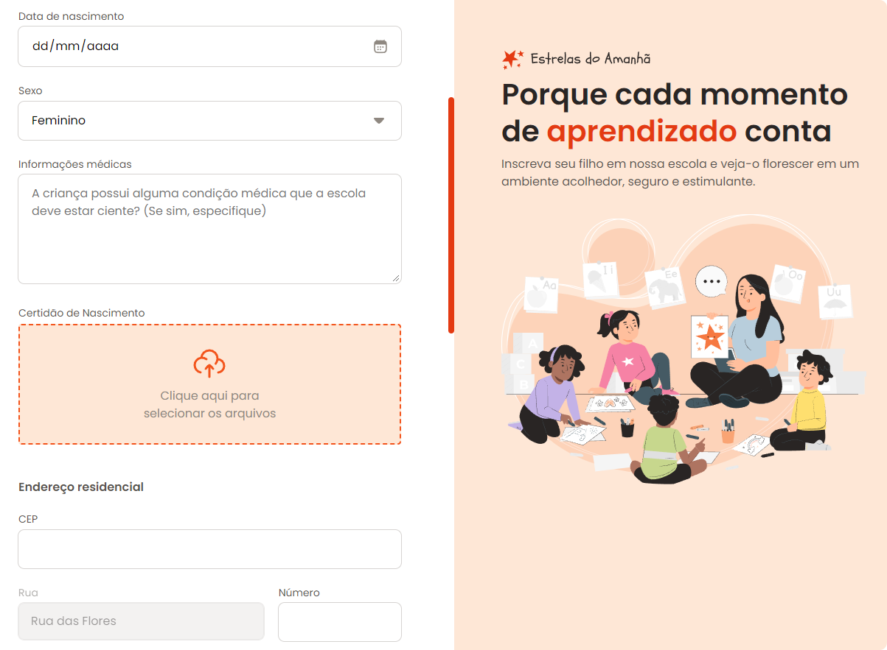

# Formulário de Matrícula

    

## Projeto
> Formação FullStack

Neste projeto, durante a aula, foi desenvolvido um formulário de matrícula onde trabalhei com diversos tipos de input. Aproveitei também para aprender a estilizar a barra de rolagem.

Também aproveitei para aprender a deixar a barra de rolagem estilizada.

## 🛠️ Tecnologias utilizadas

- HTML
- CSS
